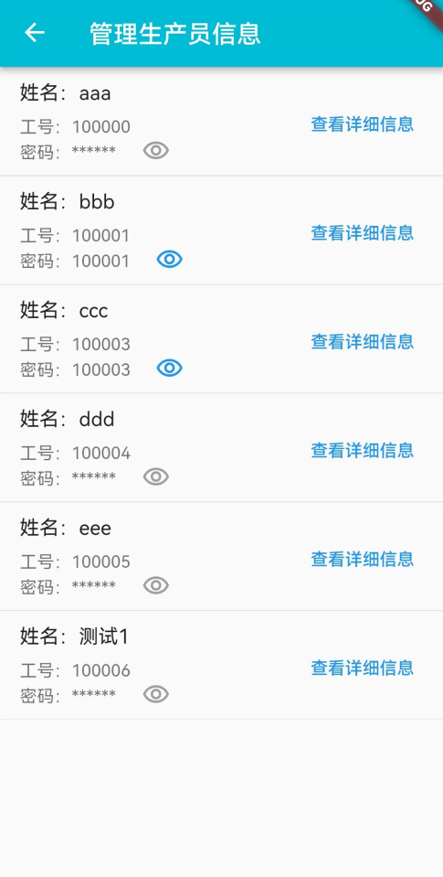

# project_app

> 本项目是市级大创项目”质量过程控制的云管理模型研究与实现“的源码实现，旨在设计能够对生产车间故障进行问题单的创建和管理的系统。
>
> 项目APP前端部分使用Flutter框架实现，后端结合Apache、MySQL、PHP等实现Web服务器的搭建和API接口设计。

## 项目结构

- `项目后端-SQL_PHP`

  > 包含项目后端服务器搭建相应的脚本文件。
  >
  > `sql脚本`中是创建MySQL数据库的命令，`PHP脚本`中是使用PHP编写的Web后端API，配置项目后端服务器需要先学习WAMP/LAMP环境搭建相关操作。

- `项目前端-Android Studio Project`

  > 包含项目前端代码，使用Flutter框架实现。

## 项目展示

APP登录界面：

问题单界面：

问题单详情页：

问题单编辑页：

问题单查询页：

问题单创建页：

消息通知页：

人员管理页：

